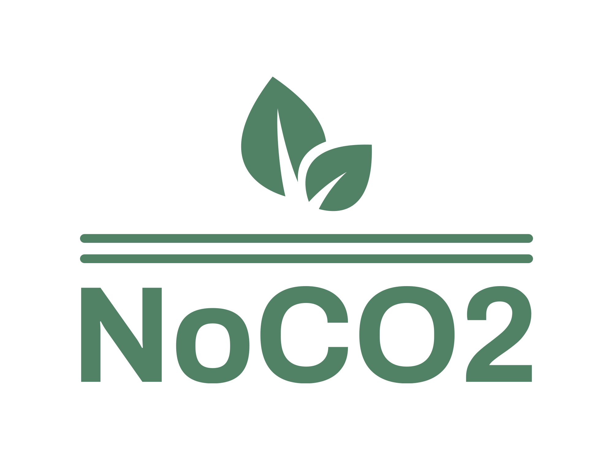

# NoCO2

<p align="center">
  
</p>

NoCO2 is a React app that allows users to monitor their daily CO2 emissions by visualizing their emission history in a line chart. 
Users can input their daily activities through a form, which is then sent to the backend for CO2 emission calculation. The app also 
provides a dashboard page where users can view statistic cards, such as the highest or average emission activity.

##Table of Contents

-[Overview](#overview)
-[Installation](#installation)
-[Usage](#usage)
-[FrontEnd](#frontend)

##Overview 

- Utilizes AWS relational database servers to host user data. (limited to ~750 hours or 20GB of general purpose SSD)
- Implements Azure Functions to run event-triggered code per user action. (limited to 1 million requests)
- Designed database for user profiles, user daily activities, and user history, in Sql.
- Features calculations for 3 emission types with an average of 11 different options per type.
- Emissions data is based of: https://www.co2everything.com/categories
- Backend Design Document: https://docs.google.com/document/d/160lD5WHeMGaCdqcMrERJ9ZNQLIFcvJkMV08khmIhUjY/edit?usp=sharing

To view deployed react page, please navigate to https://tsechapman.github.io/NoCO2/ 

## Installation

To run the NoCO2 app on your local machine, please follow these steps:

## Installation

To run the NoCO2 app on your local machine, please follow these steps:

1. Clone the repository (frontend):

```bash
git clone https://github.com/TseChapman/NoCO2.git
```

2. Navigate to the project directory:

```bash
cd NoCO2
```

3. Install the dependencies:

```bash
npm install
```

4. Define correct environment variables. Create a `.env` file containing environment variables. Then, add the following environment variables to your backend URL and firebase authentication configurations (Replace `...` accordingly).

```
REACT_APP_FIREBASE_API_KEY = "..."
REACT_APP_FIREBASE_AUTH_DOMAIN = "..."
REACT_APP_FIREBASE_PROJECT_ID = "..."
REACT_APP_FIREBASE_STORAGE_BUCKET = "..."
REACT_APP_FIREBASE_MESSAGING_SENDER_ID = "..."
REACT_APP_FIREBASE_API_ID = "..."
REACT_APP_FIREBASE_MEASUREMENT_ID = "..."
REACT_APP_NOCO2_API_URL = "..."
```
## Usage

Once you have completed the installation steps, you can start using NoCO2:

Start the development server:
```bash
npm start
```
Open your web browser and visit http://localhost:3000/NoCO2/ to access the NoCO2 app.

You can now explore the different features of the app, including entering your daily activities and viewing the line chart and statistic cards on the dashboard page once you login with a valid email and password.

## Frontend

The NoCO2 app frontend is locatied on a different repository. The frontend isbuilt using JavaScript and styled using Tailwind CSS. For more information, please check https://github.com/TseChapman/NoCO2
